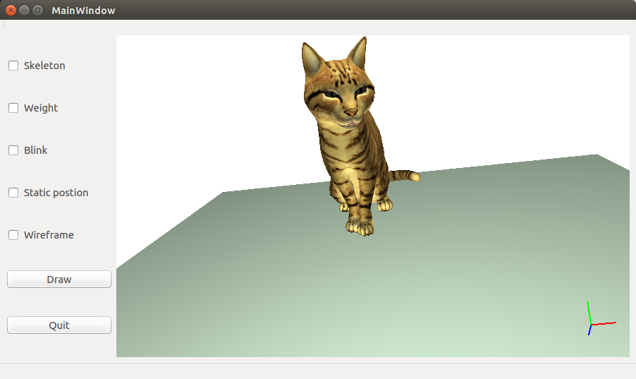

##*Introduction to mesh skinning*

-----
**CMake Build instructions**

-----
  - Out-of-source build :
 ```
git clone git@github.com:Modelisation5ETI/TP5_Skinning.git && \
mkdir TP5_Skinning-build && cd TP5_Skinning-build  && \
cmake ../TP5_Skinning  && \
make -j
 
 ```
  - QtCreator :
 ```
git clone git@github.com:Modelisation5ETI/TP5_Skinning.git  && \
mkdir TP5_Skinning-build && cd TP5_Skinning-build  && \
qtcreator ../TP5_Skinning
 
 ```
  *Then configure project using QtCreator API* : 
   - *Set the build directory to TP5_Skinning-build/*
   - *Run CMake and build project*


-----
**Implementation**

-----

 

 ```
 ./Skinning
 ```
Skinning cat using weights


 - checkbox weights : print weights on cat mesh 
 - checkbox skeleton : print the skeleton of the cat
 - checkbox blink : the cat blink

 